# 1、相关步骤

## 1.1 安装node.js和git

## 1.2 创建github账户和github.io repository

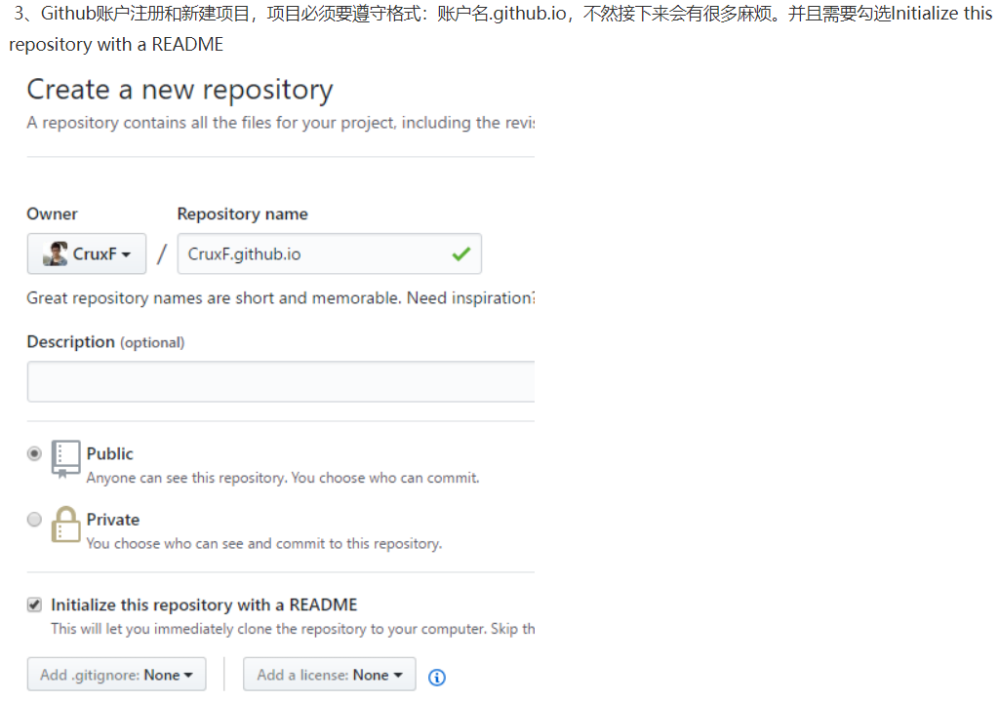

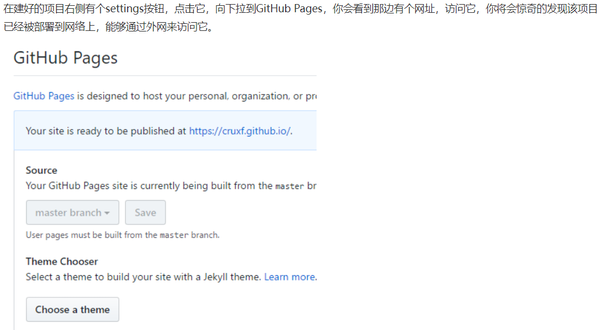

## 1.3 配置hexo

在某一个文件夹下执行以下命令安装hexo：

> npm install hexo -g 或者 cnpm install hexo -g


检查hexo是否安装成功:

> hexo -v


新建博客文件夹以D:/blog为例，以后hexo博客和配置都将保存在该文件夹下。初始化该文件夹：

> hexo init //初始化该文件夹,看到Start blogging with Hexo后表示初始化结束
>
> npm install //在该文件夹下，安装所需要的所有组件
>
> hexo s //开启服务器，正式体验hexo


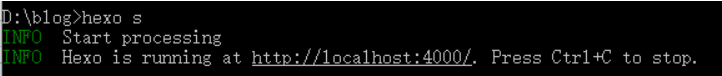


# 2、将hexo与github pages联系起来

## 2.1 设置git的username 和email

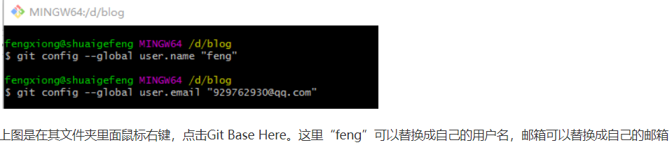

进入d:/blog/.ssh文件夹

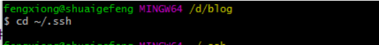

列出该文件夹下内容

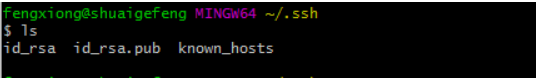

产生秘钥

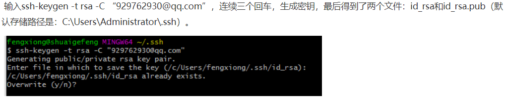

添加秘钥到ssh-agent

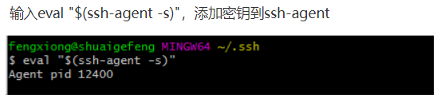

添加ssh key到ssh-agent

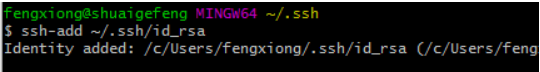

## 2.2 登录github

点击头像下的settings,添加ssh

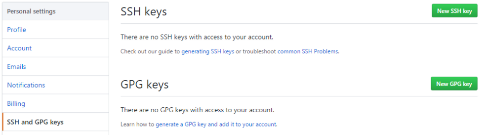

新建一个new ssh key，将id_rsa.pub文件里的内容复制上去

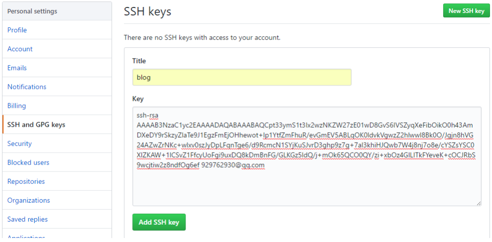

## 2.3 验证是否成功

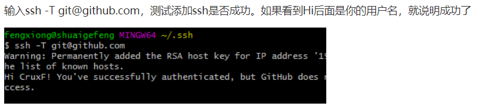

## 2.4 问题

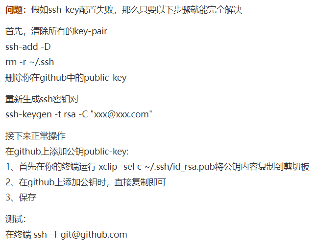

## 2.5 部署

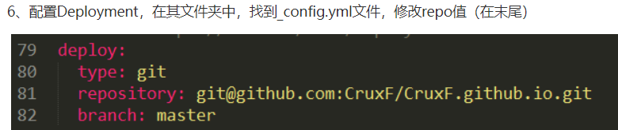

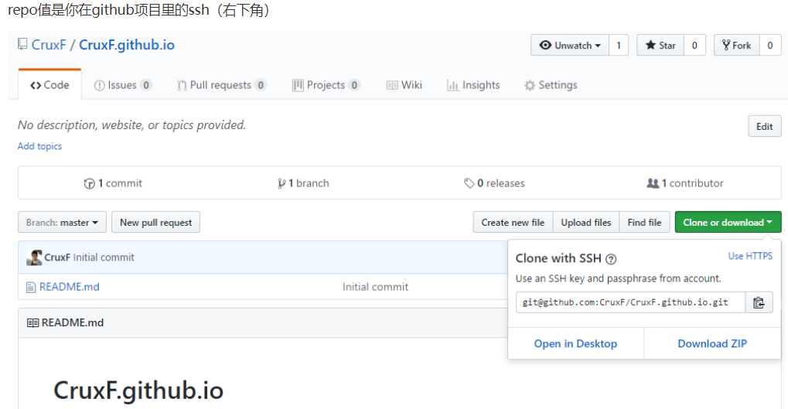

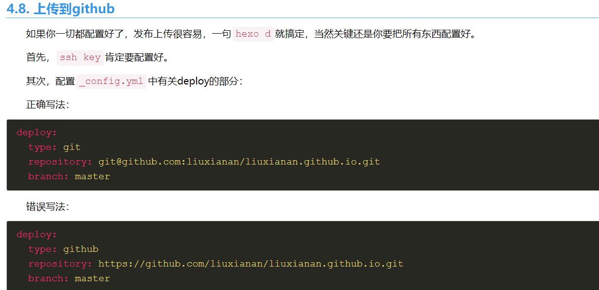


## 2.6 hexo博客目录结构

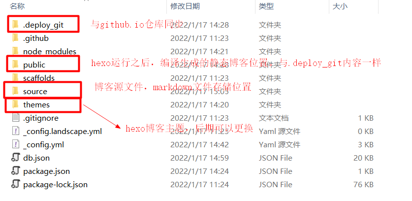

## 2.7 新建一篇博客

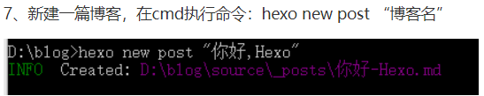

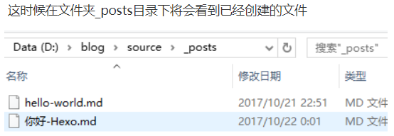

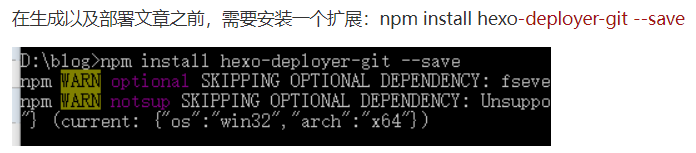

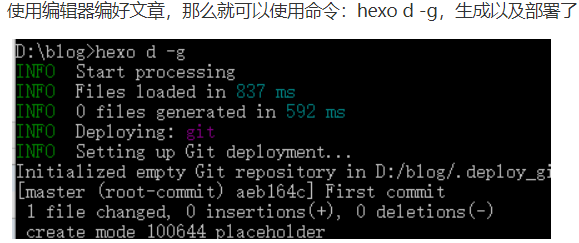

部署成功后访问你的地址：http://用户名.github.io。那么将看到生成的文章


## 2.8 hexo相关操作

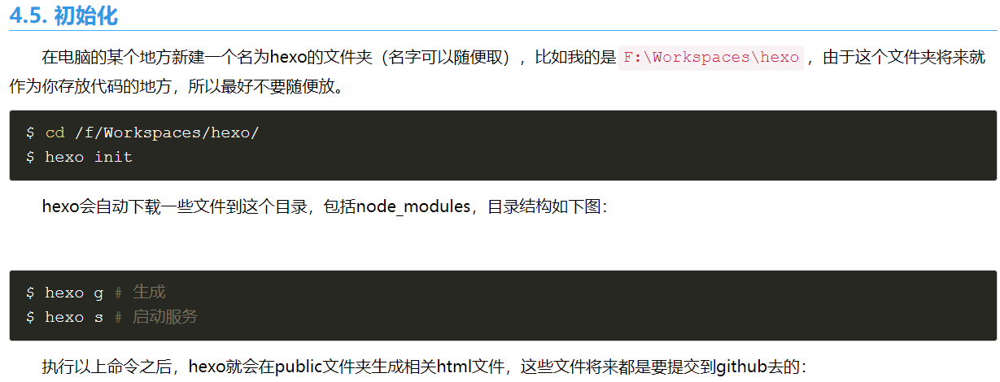

### 2.8.1 自动部署

> hexo clean
>
> hexo deploy

每次都要执行 `hexo clean` 和 `hexo deploy`，不如写个新的脚本

```javascript
// package.json
"dev": "hexo s",
"build": "hexo clean & hexo deploy"
```

部署命令

```javascript
npm run build
```


```
hexo generate
```


### 2.8.2 如何创建文章

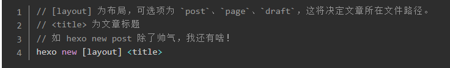

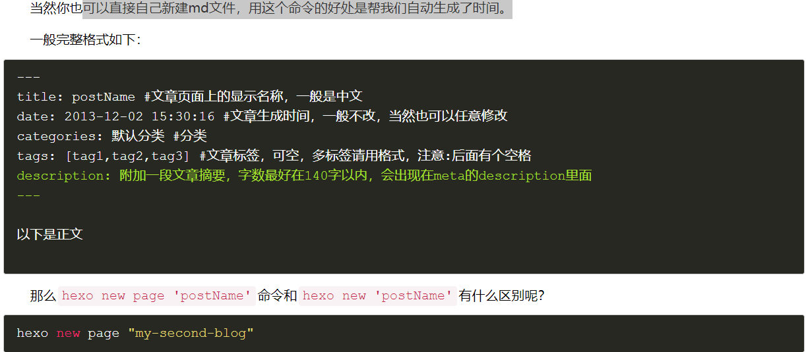


```javascript
---
title: postName #文章页面上的显示名称，一般是中文
date: 2013-12-02 15:30:16 #文章生成时间，一般不改，当然也可以任意修改
categories: 默认分类 #分类
tags: [tag1,tag2,tag3] #文章标签，可空，多标签请用格式，注意:后面有个空格
description: 附加一段文章摘要，字数最好在140字以内，会出现在meta的description里面
---

以下是正文
```


### 2.8.3 如何让博文列表不显示全部内容

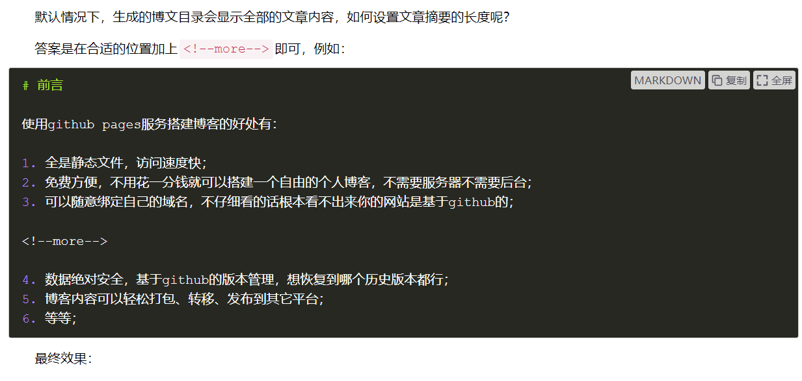

### 2.8.4 更换主题

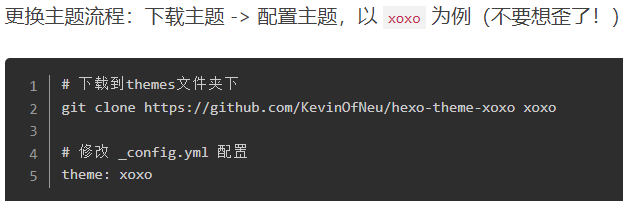


# 3、hexo博客显示图片

## 3.1 安装插件

```undefined
npm install hexo-asset-image --save
```


## 3.2 修改_config.yml

打开_config.yml文件，修改post_asset_folder为true


## 3.3 修改/node_modules/hexo-asset-image/index.js

```javascript
'use strict';
var cheerio = require('cheerio');

// http://stackoverflow.com/questions/14480345/how-to-get-the-nth-occurrence-in-a-string
function getPosition(str, m, i) {
  return str.split(m, i).join(m).length;
}

var version = String(hexo.version).split('.');
hexo.extend.filter.register('after_post_render', function(data){
  var config = hexo.config;
  if(config.post_asset_folder){
        var link = data.permalink;
    if(version.length > 0 && Number(version[0]) == 3)
       var beginPos = getPosition(link, '/', 1) + 1;
    else
       var beginPos = getPosition(link, '/', 3) + 1;
    // In hexo 3.1.1, the permalink of "about" page is like ".../about/index.html".
    var endPos = link.lastIndexOf('/') + 1;
    link = link.substring(beginPos, endPos);

    var toprocess = ['excerpt', 'more', 'content'];
    for(var i = 0; i < toprocess.length; i++){
      var key = toprocess[i];
 
      var $ = cheerio.load(data[key], {
        ignoreWhitespace: false,
        xmlMode: false,
        lowerCaseTags: false,
        decodeEntities: false
      });

      $('img').each(function(){
        if ($(this).attr('src')){
            // For windows style path, we replace '\' to '/'.
            var src = $(this).attr('src').replace('\\', '/');
            if(!/http[s]*.*|\/\/.*/.test(src) &&
               !/^\s*\//.test(src)) {
              // For "about" page, the first part of "src" can't be removed.
              // In addition, to support multi-level local directory.
              var linkArray = link.split('/').filter(function(elem){
                return elem != '';
              });
              var srcArray = src.split('/').filter(function(elem){
                return elem != '' && elem != '.';
              });
              if(srcArray.length > 1)
                srcArray.shift();
              src = srcArray.join('/');
              $(this).attr('src', config.root + link + src);
              console.info&&console.info("update link as:-->"+config.root + link + src);
            }
        }else{
            console.info&&console.info("no src attr, skipped...");
            console.info&&console.info($(this));
        }
      });
      data[key] = $.html();
    }
  }
});
```


## 3.4 创建博客

 比如hexo new post photo之后
 就在source/_posts生成photo.md文件和photo文件夹，我们把要插入的图片复制到photo文件夹内，
 在photo.md文件里面按markdown的标准写,（我的文件名是head.jpeg）比如

```bash

```


# 4、hexo常用命令

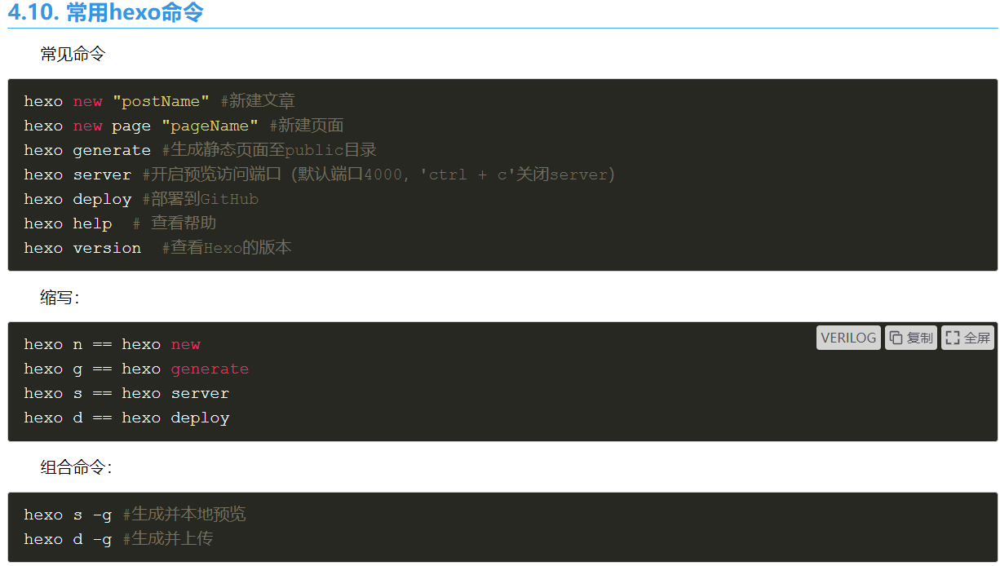

# 5、hexo主题


# 6、hexo博客多台电脑设备同步管理


# 参考文档

[使用Hexo+Github一步步搭建属于自己的博客](https://www.cnblogs.com/fengxiongZz/p/7707219.html)

[使用Hexo+Github一步步搭建属于自己的博客-切换主题以及其他内容设置](https://www.cnblogs.com/fengxiongZz/p/7707568.html)

[屠-成-主题](https://www.haomwei.com/)

[hexo博客多台电脑设备同步管理](https://www.jianshu.com/p/0558c041e56d)

